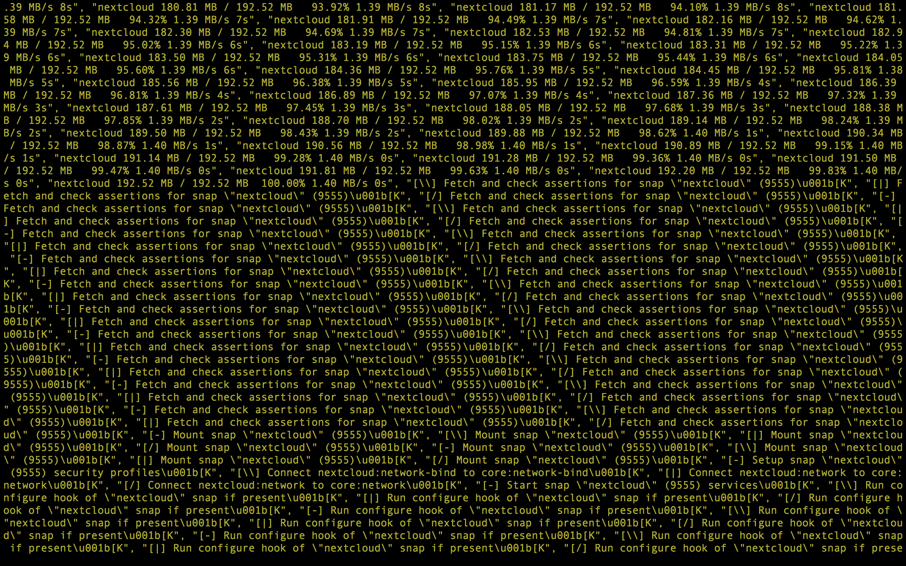

# Stealthcloud

> :exclamation: _This project is under construction!_

Stealthcloud is a delicious mixture of Ansible roles that provide the user with an automatic spin-up of a [Nextcloud](https://nextcloud.com/) instance hosted on a stealth [Onion service](https://www.torproject.org/docs/onion-services). It also implements specific roles for hardening the base configuration of the server used.

## Roles

Like vegetables in a soup, Stealthcloud utilizes the following roles as ingredients, which each have their own repositories:

* [ansible-nextcloud](https://github.com/aubrel/ansible-nextcloud) - Basic Nextcloud provisioning role.
* [ansible-role-tor](https://github.com/AnarchoTechNYC/ansible-role-tor) - Stealth onion service provisioning role. One can also find a lot of great further explanations of Onion services and specifics in this repository.
* [ansible-role-common](https://github.com/anarchotechnyc/ansible-role-common) - Takes care of a few base hardening things. (Still in progress.)
